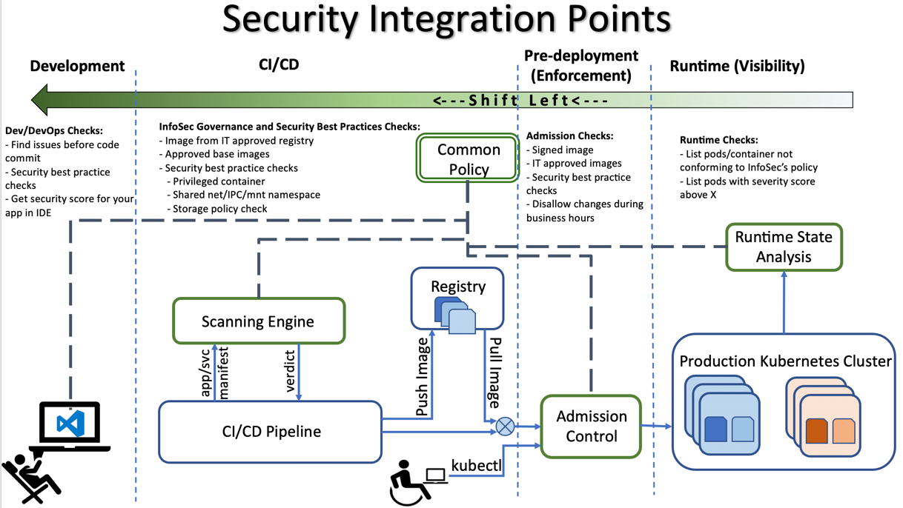

# Cloud Native Security 🔥

This is a detailed checklist for securing your kubernetes environment. 

- Checkout https://github.com/gunjan5/container-security for a high level container security recommendations.
- This is part of my talk at Ignite Europe 2019. 
- You can find the slides here: https://bit.ly/cloud-native-security-slides

## Kubernetes Security Checklist

| Risk Score | Responsible Team | Description |
| :---: | :---: | --- |
| 10 | Apps | ImagePull Policy to set to 'Always' |
| 3 | Apps | Have an annotation for each deployment with owner email, so we can find the dev owner of that app  |
| 10 | Apps & Infra | Network Policy must be enabled and enforced at least at namespace level |
| 7 | Apps & Infra | Istio policies applied at a higher level in conjunction with Network Policies |
| 10 | Apps & Infra | service to service traffic should be mTLS using service mesh like istio |
| 9 | Infra | Binary Auth for gcr images |
| 9 | Infra | Admission controller where InfoSec & SRE enforce policies in prod |
| 8 | Infra | Must use COS or similar hardened OS in Prod |
| 10 | Infra | Separate registries for prod, dev and staging. No access to a person in prod gcr. A way of promoting images to prod |
| 5 | Infra | API server, kubelet upgrade SLA. Follow https://groups.google.com/forum/#!forum/kubernetes-announce and take action |
| 10 | Apps | No privilaged pods/containers |
| 9 | Apps | No containers running with default user (default is root!) |
| 10 | Apps | Lock down 3rd party app RBAC, don't just accept what's in the docs. Try with lower permissions and go up |
| 10 | Apps | K8s RBAC for user groups (SRE, DevOps, InfoSec, Dev, Debugging, etc.) |
| 7 | Apps | Proper use of namespaces (so you can apply network policies, RABC, secret sharing, etc.) |
| 10 | Infra | Image must be scanned for vulnerability and signed before it can be deployed in prod |
| 7 | Apps | Pods with unnecessory ADD_CAP are equally dangerous as privilaged pods |
| 6 | Apps | Host mounts, by sharing host mounts, you're removing the filesystem isolation provided by containers |
| 10 | Apps | Pods with net=host (network namespace shared between host and the pod) |
| 7 | Apps | Disable Service Account auto-mount |
| 10 | Apps | Make your container filesystem read-only using security context |
| 10 | Apps | Developers should use minimal OS and don't stuff the whole runtime and OS |
| 9 | Infra | GKE: subscribe to "Regular" or "Stable" channel for the Kube API server (similar for other hosted k8s) |
| 7 | Infra | Each team should have PSP (Pod Security Policy) enabled with policies and exceptions managed by the SRE team |
| 8 | Infra | Don't allow 'latest' or 'dev' or 'master' image tags in prod. Always use versioned tags |
| 9 | Apps | Limit who can talk to the API serve, exception granted to some 3rd party apps like Twistlock, Calico, istio, helm, etc. |
| 9 | Apps | Must specify resource limits at deployment level (limit admission controller) |
| 5 | Apps | Specify resource quota per namespace |
